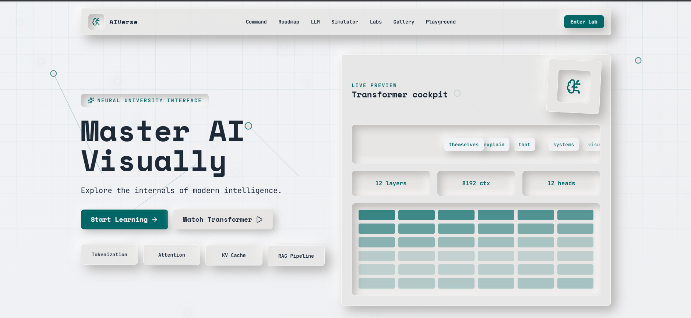
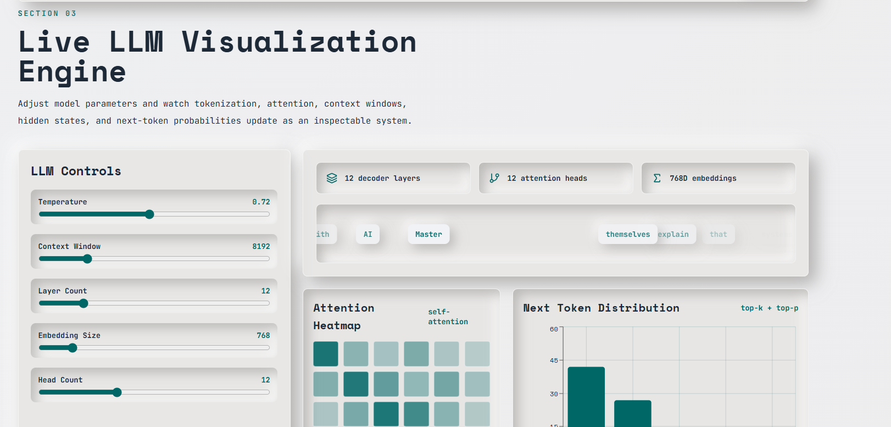
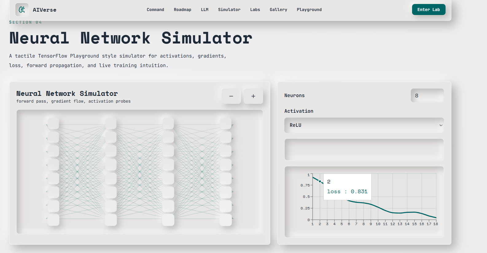

<div align="center">


</div>

<div align="center">


<br/><br/>

[](.)
[](https://react.dev)
[](https://vitejs.dev)
[](https://threejs.org)
[](.)

<br/>

[](.)
[](.)
[](.)
[](.)

</div>

<br/>

<div align="center">

```
╔══════════════════════════════════════════════════════════════════════╗
║  Not a course. Not a tutorial. Not a demo.                          ║
║  AIVerse is an operating system for understanding artificial         ║
║  intelligence — through interaction, simulation, and visualization. ║
╚══════════════════════════════════════════════════════════════════════╝
```

</div>

---

<div align="center">

## `>_ what is aiverse`

</div>

**AIVerse** is a visual-first, interactive AI learning OS that transforms how developers, researchers, and students master artificial intelligence. Forget passive reading. Forget watching videos. In AIVerse, you *operate* AI concepts — you train networks live, watch attention mechanisms fire in real time, navigate 3D transformer architectures, and run RAG pipelines in interactive sandboxes.

Built around an OS-like interface with a command palette, workspace system, and modular domain labs, AIVerse treats AI education as an engineering discipline — not a content delivery problem.

<div align="center">

| Dimension | What AIVerse Delivers |
|:---|:---|
| 🧠 **Depth** | From neural network primitives to production RAG systems |
| 🎮 **Interactivity** | Simulations, visual challenges, live training, 3D worlds |
| 🖥️ **Interface** | OS-like command center, terminal, workspace, marketplace |
| 🌐 **Breadth** | 8 major AI domains, 30+ interactive components |
| 🎨 **Aesthetics** | Neo-glassmorphism, animated matrices, particle systems |

</div>

---

<div align="center">

## `>_ platform.preview`

</div>

<table align="center">
<tr>
<td align="center" width="50%">

**OS Interface & Command Center**



</td>
<td align="center" width="50%">

**Interactive Learning Dashboard**



</td>
</tr>
<tr>
<td align="center" colspan="2">

**Neural Network Visualization Engine**



</td>
</tr>
</table>

---

<div align="center">

## `>_ tech.stack`

</div>

<table align="center">
<tr>
<td valign="top" width="25%">

### 🖥️ Frontend Core


- React **19.2.1**
- Vite **7.2.7**
- React Router **7.15.0**
- Tailwind CSS **3.4.18**

</td>
<td valign="top" width="25%">

### 🌐 3D & Visualization


- Three.js **0.181.2**
- React Three Fiber **9.4.0**
- React Three Drei **10.7.7**
- D3.js **7.9.0** + Recharts

</td>
<td valign="top" width="25%">

### 🎬 Motion & Editing


- Framer Motion **12.23.24**
- Monaco Editor **0.53.0**
- XYFlow **12.9.3** (node graphs)
- Lucide React icons

</td>
<td valign="top" width="25%">

### ⚙️ State & Build


- Zustand **5.0.9**
- PostCSS **8.5.6**
- ESLint config
- Vercel deployment

</td>
</tr>
</table>

<div align="center">

**Full badge inventory:**


</div>

---

<div align="center">

## `>_ learning.domains`

*Eight complete AI domains. Each is a fully interactive lab, not a chapter.*

</div>

<table align="center">
<tr>
<td width="25%" align="center" valign="top">

**🔮 Transformers**

Attention mechanisms, positional encoding, and full transformer architecture — navigated as an interactive 3D scene. Watch attention heads fire across token sequences.

</td>
<td width="25%" align="center" valign="top">

**🧬 Neural Networks**

Live training canvas. Draw your architecture, set hyperparameters, watch loss curves converge in real time. Backpropagation visualized layer by layer.

</td>
<td width="25%" align="center" valign="top">

**🗣️ LLMs**

Tokenization explorer, prompt engineering sandbox, and model comparison lab across major architectures. Understand what happens between input and output.

</td>
<td width="25%" align="center" valign="top">

**👁️ Computer Vision**

CNN feature map visualizer, object detection playground, and image processing pipeline. See what the model actually sees at every layer.

</td>
</tr>
<tr>
<td width="25%" align="center" valign="top">

**📡 AI Agents**

Multi-agent system simulator. Define goals, tools, and memory — watch agents plan, act, and coordinate autonomously in sandboxed environments.

</td>
<td width="25%" align="center" valign="top">

**🔍 RAG Systems**

Full retrieval-augmented generation playground. Upload documents, configure vector retrieval, and watch context assembly happen in real time.

</td>
<td width="25%" align="center" valign="top">

**📊 Machine Learning**

Supervised, unsupervised, and reinforcement learning — each with interactive dataset explorers, embedding visualizers, and decision boundary renderers.

</td>
<td width="25%" align="center" valign="top">

**🛡️ AI Safety**

Alignment, interpretability, and responsible AI — explored through interactive case studies, bias detection tools, and adversarial example generators.

</td>
</tr>
</table>

---

<div align="center">

## `>_ platform.modules`

</div>

<details>
<summary><strong>🔬 Transformer Lab</strong> — Interactive attention & architecture explorer</summary>

<br/>

The Transformer Lab renders the full encoder-decoder architecture as an interactive 3D scene built on React Three Fiber. Users can:

- Navigate the architecture spatially — zoom into attention heads, rotate the positional encoding block
- Feed custom token sequences and watch attention weights animate across the matrix in real time
- Toggle between multi-head configurations and observe how each head specializes
- Inspect the math: Q, K, V matrices rendered as animated heat maps

**Core components:** `TransformerScene3D`, `AttentionMapVisualizer`, `TokenFlowAnimation`, `PositionalEncodingExplorer`

</details>

<details>
<summary><strong>🧠 Neural Network Simulator</strong> — Live training with visual backpropagation</summary>

<br/>

The Neural Network Canvas lets users build, configure, and train custom architectures directly in the browser:

- Drag-and-drop layer construction with XYFlow node editor
- Real-time loss curve and accuracy tracking via Recharts
- Backpropagation visualized as gradient flow through each layer
- Preset architectures: MLP, CNN, RNN, Autoencoder — all trainable on built-in datasets

**Core components:** `NeuralNetworkCanvas`, `TrainingMetricsChart`, `GradientFlowVisualizer`, `LayerInspector`

</details>

<details>
<summary><strong>📚 RAG Playground</strong> — Full retrieval-augmented generation sandbox</summary>

<br/>

Build and run RAG pipelines interactively:

- Upload documents → chunking strategy visualization → embedding generation → vector store
- Query interface shows retrieval results ranked by cosine similarity with visual score bars
- Embedding Explorer: 3D PCA/UMAP projection of your document corpus
- Swap retrievers and observe answer quality delta in real time

**Core components:** `RAGPipeline`, `EmbeddingExplorer`, `VectorRetrievalVisualizer`, `ChunkingStrategySelector`

</details>

<details>
<summary><strong>🤖 AI Agents System</strong> — Multi-agent sandbox with tool use</summary>

<br/>

Define agents with goals, memory types, and tool access — then watch them operate:

- Visual agent graph showing inter-agent communication and task delegation
- Tool call trace: each external action logged with inputs, outputs, and latency
- Memory inspector: observe short-term, long-term, and episodic memory states
- Configurable environments: web search, code execution, document retrieval

**Core components:** `AgentOrchestrator`, `ToolCallTrace`, `MemoryInspector`, `AgentCommunicationGraph`

</details>

<details>
<summary><strong>🌌 3D AI Worlds</strong> — Immersive spatial learning environments</summary>

<br/>

Navigate AI concepts as explorable 3D spaces:

- Transformer World: walk through the architecture spatially
- Embedding Space: fly through a 3D word embedding cluster
- Neural Landscape: terrain rendered from loss surface topology
- Particle Systems: data points visualized as interactive 3D particle clouds

**Core components:** `WorldCanvas`, `EmbeddingSpace3D`, `LossSurfaceTerrain`, `ParticleDataCloud`

</details>

<details>
<summary><strong>🖥️ AI Terminal & Command Center</strong> — OS-like interface layer</summary>

<br/>

AIVerse wraps every module in an OS metaphor:

- **Command Palette** (`⌘K`): instant fuzzy search across all features, labs, and concepts
- **AI Terminal**: execute natural language commands that navigate the platform or explain concepts
- **Workspace System**: save, organize, and resume learning sessions across domains
- **Global Controls**: theme, animation density, accessibility preferences

**Core components:** `CommandPalette`, `AITerminal`, `WorkspaceSystem`, `OSLayout`, `Sidebar`, `TopBar`

</details>

<details>
<summary><strong>🎮 Visual Challenge System</strong> — Gamified knowledge testing</summary>

<br/>

Learning reinforced through interactive challenges:

- **Adaptive Quiz Engine**: difficulty adjusts dynamically to your performance curve
- **Challenge Board**: curated challenges from the community, ranked by difficulty
- **Model Comparison Lab**: given two model outputs, identify which architecture produced it
- **Achievement System**: milestones, streaks, and domain mastery badges

**Core components:** `AdaptiveQuiz`, `ChallengeBoard`, `ModelComparisonLab`, `AchievementTracker`

</details>

---

<div align="center">

## `>_ system.architecture`

</div>

```
┌─────────────────────────────────────────────────────────────────┐
│                        USER INTERFACE                           │
│   OS Shell · Command Palette · AI Terminal · Workspace System   │
└────────────────────────────┬────────────────────────────────────┘
                             │
┌────────────────────────────▼────────────────────────────────────┐
│                     VISUALIZATION ENGINE                        │
│  Three.js 3D Canvas · D3 Graphs · Framer Motion · XYFlow Nodes │
└────────────────────────────┬────────────────────────────────────┘
                             │
┌────────────────────────────▼────────────────────────────────────┐
│                     SIMULATION LAYER                            │
│   Neural Trainer · Attention Engine · Agent Orchestrator · RAG  │
└──────────┬─────────────────┬──────────────────┬────────────────┘
           │                 │                  │
┌──────────▼───┐   ┌─────────▼──────┐   ┌──────▼──────────────┐
│  DOMAIN LABS │   │ LEARNING ENGINE│   │  STATE & PERSISTENCE │
│  8 AI domains│   │ Zustand store  │   │  Workspace · Profile │
│  30+ modules │   │ React Query    │   │  Progress · Settings │
└──────────────┘   └────────────────┘   └─────────────────────┘
```

```
src/
├── app/                     # Application entry & providers
├── components/
│   ├── ai/                  # AI tutors, model interfaces
│   ├── animations/          # Motion effects, particle systems
│   ├── charts/              # Data visualization components
│   ├── learning/            # Interactive learning modules
│   ├── os/                  # OS shell, command palette, terminal
│   ├── playground/          # Sandbox & experimental components
│   ├── simulations/         # Neural & physics simulation engines
│   └── visualizers/         # 3D & 2D visualization engines
├── features/                # Domain-specific logic (8 AI domains)
├── store/                   # Zustand global state
├── services/                # Business logic & AI service layer
├── hooks/                   # Custom React hooks
└── routes/                  # Route definitions & OS navigation
```

---

<div align="center">

## `>_ quick.start`

</div>

**Prerequisites:** Node.js 16+ · npm or yarn

```bash
# 1. Clone the repository
git clone https://github.com/kh-bikash/AIVerse.git
cd AIVerse

# 2. Install dependencies
npm install

# 3. Launch the OS
npm run dev
# → Available at http://localhost:5173
```

**Available commands:**

```bash
npm run dev        # Start dev server (hot reload on 0.0.0.0:5173)
npm run build      # Production build → /dist
npm run preview    # Preview production build locally
npm run lint       # ESLint code quality check
```

**Docker (optional):**
```bash
docker build -t aiverse .
docker run -p 5173:5173 aiverse
```

> The platform auto-navigates to the learning dashboard on first launch. Use `⌘K` to open the command palette and explore all features instantly.

---

<div align="center">

## `>_ roadmap`

</div>

**Phase 1 — Foundation** ✅
- [x] OS-like interface with command palette & workspace system
- [x] 8 core AI learning domains with interactive labs
- [x] Neural Network Canvas with live training visualization
- [x] Transformer 3D Scene with attention map explorer
- [x] RAG Playground with embedding visualizer
- [x] AI Agents system with tool-use sandbox
- [x] Adaptive quiz engine & challenge board
- [x] Monaco-based code editor integration
- [x] Glassmorphism design system & particle animations

**Phase 2 — Intelligence Layer** 🔄 In Progress
- [ ] Live LLM integration (inference via API) inside learning modules
- [ ] Collaborative learning sessions — multi-user workspace
- [ ] Community Marketplace — share custom labs & challenges
- [ ] AI Tutor upgrade — conversational, context-aware guidance
- [ ] Voice Tutor — audio-first learning mode

**Phase 3 — Platform Scale** 📋 Planned
- [ ] LoRA fine-tuning playground — train adapters in-browser
- [ ] Diffusion Lab — interactive image generation & latent space explorer
- [ ] Backend API layer (FastAPI) for persistent user data & model serving
- [ ] User profiles, progress analytics, and learning path recommendations
- [ ] Mobile-responsive redesign with touch-optimized interactions

**Phase 4 — Ecosystem** 🔮 Vision
- [ ] Plugin SDK — third-party lab modules
- [ ] Institution licensing — classroom deployment mode
- [ ] Offline mode — full PWA with cached lab environments
- [ ] AIVerse API — embed visualizations in external projects

---

<div align="center">

## `>_ contributing`

</div>

AIVerse is built for the community and improves through community contribution. Every lab, visualizer, and simulation was designed to be modular and extensible.

**Ways to contribute:**

```
New AI Domain Lab     →  Add a new domain under src/features/
New Visualizer        →  Add components to src/components/visualizers/
New Simulation        →  Add engines to src/components/simulations/
Bug Fix               →  Open an issue, reference it in your PR
Design Improvement    →  UI/UX contributions especially welcome
Documentation         →  Concept explanations, code comments, guides
```

**Contribution flow:**

```bash
# 1. Fork the repository
# 2. Create a feature branch
git checkout -b feat/diffusion-lab

# 3. Build your feature with tests
npm run dev

# 4. Lint before submitting
npm run lint

# 5. Open a Pull Request with:
#    - What you built
#    - Screenshots or screen recording
#    - Which AI concept it teaches
```

> First time contributing? Look for issues tagged `good first issue` or `help wanted`. All skill levels welcome.

---

<div align="center">

## `>_ github.stats`

</div>

<div align="center">


&nbsp;


</div>

<div align="center">


</div>

<div align="center">

<picture>
  <source media="(prefers-color-scheme: dark)" srcset="https://raw.githubusercontent.com/kh-bikash/kh-bikash/output/github-contribution-grid-snake-dark.svg"/>
  
</picture>

</div>

---

<div align="center">

## `>_ community`

*Build in public. Learn in public. Ship in public.*

<br/>

[](https://github.com/kh-bikash/AIVerse/discussions)
[](https://www.linkedin.com/in/bikash-kh-5544ba298/)
[](https://dev.to/kh_bikash22)
[](mailto:khbikash17@gmail.com)

<br/>

> ⭐ **Star this repo** if AIVerse helped you understand AI differently.
> It's the highest-signal way to support the project and reach more learners.

</div>

---


<div align="center">

<sub>

```
╔══════════════════════════════════════════════════════════════════════════╗
║  "AI is not a subject you read about. It's a system you operate."        ║
╚══════════════════════════════════════════════════════════════════════════╝
```

**AIVerse** — AI Learning Operating System
Built by [Khundrakpam Bikash Meitei](https://github.com/kh-bikash) · Manipur, India 🇮🇳

*For every developer who wanted to understand AI from the inside out.*

</sub>

</div>
